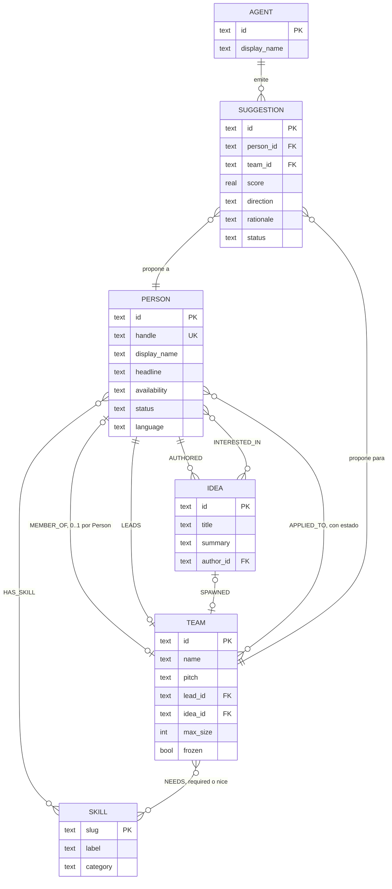
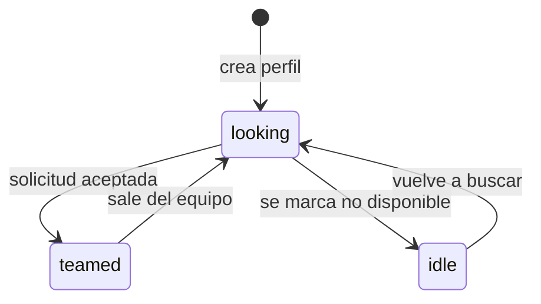
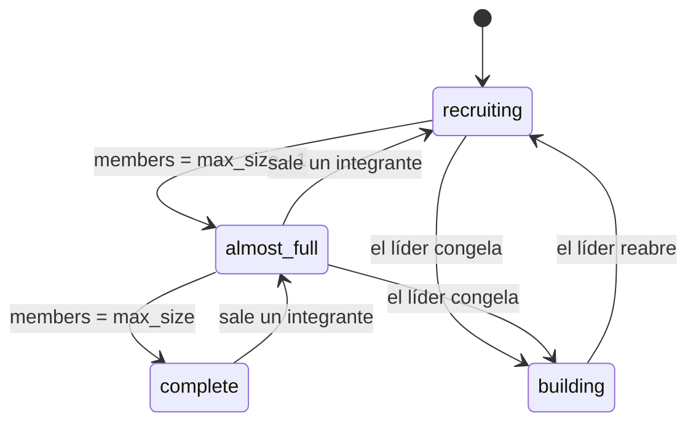
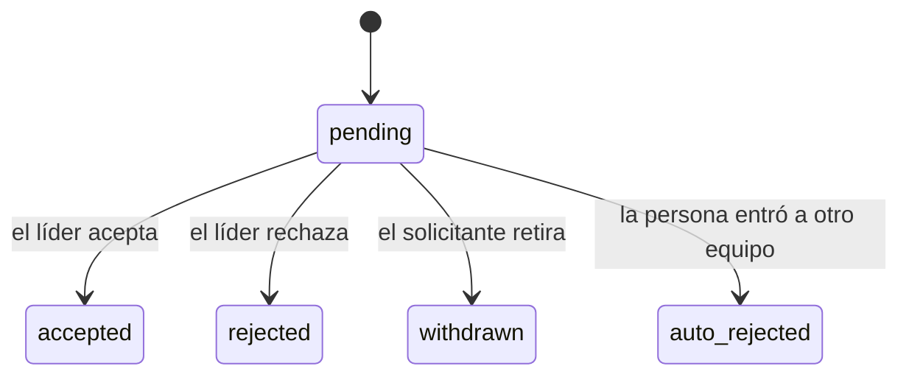

# 02 — Modelo de dominio

El dominio es un grafo. Toda entidad es un nodo tipado y toda relación es una arista tipada.

## Glosario

| Término | Definición |
|---|---|
| **Person** | Participante de la red. Se crea al completar el perfil y es el único nodo con identidad de sesión. |
| **Idea** | Propuesta de proyecto publicada por una Person. Existe con o sin equipo. |
| **Team** | Grupo que construye un proyecto. Su tamaño máximo es un atributo del propio Team (`max_size`), con valor por defecto **4**. |
| **Skill** | Tag del vocabulario canónico. Conjunto cerrado: no se crean skills en runtime. |
| **Need** | Skill que un Team declara faltante, con prioridad `required` o `nice`. |
| **Application** | Solicitud de una Person para integrarse a un Team. |
| **Suggestion** | Recomendación del agente. Es una *propuesta* de arista, no una arista de dominio. |
| **Agent** | `matchmaker`. Nodo de primera clase: aparece en el grafo y en el feed como un participante. |

## Diagrama de entidades



La distribución física de estas entidades en tablas está en [04](04-data-model.md).

## Nodos

```
Person   { id, handle, display_name, headline, bio_raw, availability,
           status, language, recovery_code, created_at }
Idea     { id, title, summary, author_id, created_at }
Team     { id, name, pitch, status, lead_id, idea_id?, max_size=4, created_at }
Skill    { id, slug, label, category }
Agent    { id='matchmaker', display_name='MatchMaker' }
```

`Skill.category` ∈ `frontend` · `backend` · `mobile` · `data-ai` · `design` · `product` · `infra` · `other`.

La categoría cumple dos funciones: agrupa el grafo visualmente y sostiene el scoring cuando un equipo pide un perfil amplio en lugar de una tecnología concreta ([06](06-matchmaker-agent.md)).

## Aristas

| Arista | Origen → Destino | Atributos | Cardinalidad |
|---|---|---|---|
| `HAS_SKILL` | Person → Skill | — | 0..n |
| `NEEDS` | Team → Skill | `priority` (`required`\|`nice`) | 0..n |
| `MEMBER_OF` | Person → Team | `role`, `joined_at` | **0..1 por Person** |
| `LEADS` | Person → Team | — | 0..1 por Team |
| `INTERESTED_IN` | Person → Idea | — | 0..n |
| `AUTHORED` | Person → Idea | — | 1 por Idea |
| `SPAWNED` | Idea → Team | — | 0..1 |
| `APPLIED_TO` | Person → Team | `status`, `message` | 0..1 activa por par |
| `SUGGESTED` | Agent → (Person, Team) | `score`, `rationale`, `expires_at` | 0..n |

`SUGGESTED` conecta tres nodos. Se materializa como una arista `Person ↔ Team` con `kind='suggested'` y `author='matchmaker'`, de modo que el frontend la dibuja diferenciada (punteada, animada) sin lógica adicional.

## Máquinas de estado

### Person.status



| Estado | Significado |
|---|---|
| `looking` | Busca equipo. **Solo estas personas son candidatas del matchmaker.** |
| `teamed` | Tiene `MEMBER_OF`. Se asigna al aceptar una Application. |
| `idle` | No busca. Excluida del matching, visible en el grafo. |

### Team.status

Derivado del conteo de miembros y de `frozen`. `building` es el único que se escribe explícitamente y prevalece sobre el cálculo, para que un líder pueda cerrar el equipo con menos de `max_size` integrantes.

**La derivación es una cascada y el primer caso que aplica gana.** El orden es parte de la definición: sin él, un equipo con `max_size - 1` integrantes y needs sin cubrir satisface dos condiciones a la vez.

| Orden | Estado | Condición |
|---|---|---|
| 1 | `building` | `frozen = true`; lo marca el líder y congela el reclutamiento |
| 2 | `complete` | `members = max_size` |
| 3 | `almost_full` | `members = max_size - 1` |
| 4 | `recruiting` | cualquier otro caso |

`recruiting` es el caso por defecto y no exige que haya `NEEDS` required sin cubrir: un equipo con hueco está reclutando aunque todavía no haya declarado qué le falta. Un equipo sin needs no produce candidatos de todos modos, porque la consulta del matchmaker parte de sus aristas `NEEDS` ([06](06-matchmaker-agent.md)).



Con `max_size = 4` el estado inicial es siempre `recruiting`, que es el caso normal. Dos configuraciones nacen en otro estado y la cascada las resuelve sin ambigüedad: con `max_size = 2` el equipo nace `almost_full` —tiene a su líder y le falta uno—, y con `max_size = 1` nace `complete`. Este último no recibe sugerencias nunca, por el guardarraíl 6 de [06](06-matchmaker-agent.md), que es el comportamiento correcto para un equipo de una sola persona.

### Application.status



## Invariantes

Se aplican en la capa de servicio **y** con constraints en la base de datos. Un invariante que solo vive en el código no es un invariante.

| # | Invariante | Cómo se aplica |
|---|---|---|
| 1 | Una Person pertenece como máximo a un Team | índice único parcial sobre `edges(from_id) where kind='member_of'` |
| 2 | Un Team nunca supera su `max_size` (1–4, por defecto 4) | validación en transacción; devuelve `409 TEAM_FULL` |
| 3 | El líder es miembro | `LEADS` y `MEMBER_OF` se insertan en la misma transacción |
| 4 | Una sola Application `pending` por par (Person, Team) | índice único parcial; el reintento devuelve la existente |
| 5 | Aceptar una Application propaga el estado completo | crea `MEMBER_OF`, pasa la Person a `teamed`, recalcula `Team.status`, marca `auto_rejected` las demás pendientes de esa persona e invalida sus Suggestions vivas |
| 6 | Los Skills son vocabulario cerrado | un `slug` fuera de `skills` ∪ `skill_aliases` devuelve `422 UNKNOWN_SKILL` |
| 7 | `Team.status` es derivado salvo `building` | cascada de precedencia; se recalcula ante cualquier cambio de membresía o de `frozen` |
| 8 | Una Suggestion caduca a las 2 h | `expires_at`; al caducar deja de dibujarse |
| 9 | El agente no sugiere personas `teamed` ni `idle`, ni equipos `complete` o `building` | filtrado en SQL |

## Criterios de aceptación

Formato Given/When/Then. Son los que se prueban; si uno falla, el MVP no está listo.

**AC-01 — Extracción de skills**
> **Dado** que una persona escribe "Trabajo principalmente con Angular, Go y PostgreSQL"
> **Cuando** guarda su perfil
> **Entonces** recibe `HAS_SKILL` hacia `angular`, `go`, `postgresql`, `frontend` y `backend`, todos del vocabulario canónico
> **Y** no se persiste ningún skill fuera del vocabulario.

**AC-02 — El equipo encuentra a la persona**
> **Dado** un Team `Health AI` con `NEEDS` = {`go` (required), `figma` (nice)}
> **Y** una Person `looking` con `HAS_SKILL` = {`go`, `postgresql`}
> **Cuando** el líder publica esa necesidad
> **Entonces** en menos de 5 s el MatchMaker publica un `match.suggested` con esa persona
> **Y** el rationale nombra `go` explícitamente
> **Y** la arista aparece en el grafo de todos los clientes conectados sin recargar.

**AC-03 — La persona encuentra al equipo**
> **Dado** que existe `Health AI` reclutando `go`
> **Cuando** una Person nueva se registra con `go`
> **Entonces** recibe una sugerencia hacia `Health AI` en su inbox
> **Y** el mismo evento aparece en el feed público como actividad del agente.

**AC-04 — Aceptación en vivo**
> **Dado** una Application `pending`
> **Cuando** el líder la acepta
> **Entonces** el solicitante pasa a `teamed` y el Team recalcula su `status`
> **Y** todos los clientes ven aparecer la arista `MEMBER_OF`
> **Y** las demás applications pendientes de esa persona quedan `auto_rejected`.

**AC-05 — Límite de equipo**
> **Dado** un Team con 4 integrantes
> **Cuando** el líder intenta aceptar otra Application
> **Entonces** la operación falla con `409 TEAM_FULL` y no se publica nada a Portal.

**AC-06 — Reconexión**
> **Dado** un cliente que perdió conexión durante 2 minutos
> **Cuando** reconecta y detecta un hueco de `seq`
> **Entonces** solicita `GET /v1/graph` de nuevo y su grafo queda idéntico al de un cliente que nunca se desconectó.
