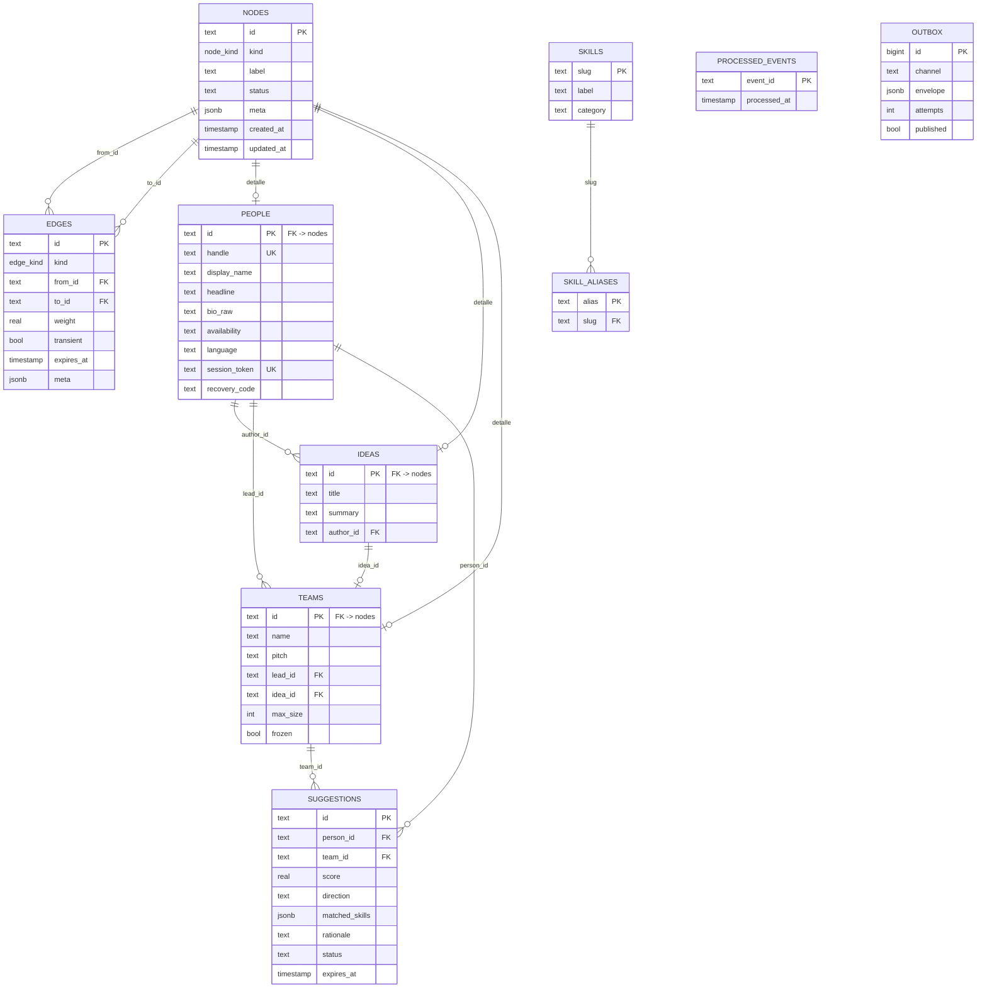

# 04 — Modelo de datos

PostgreSQL (Supabase). El grafo se modela **explícito**: dos tablas centrales, `nodes` y `edges`, más tablas de detalle por tipo de nodo.

## Estructura

Dos capas:

- **Grafo** — `nodes` y `edges`. El snapshot completo son dos `SELECT` sin ensamblaje, y agregar un tipo de arista es una fila en un enum. La forma del almacenamiento sigue a la forma del consumo: el frontend consume grafo.
- **Detalle** — `people`, `teams`, `ideas`. Guardan los campos con esquema propio (bio, pitch, headline) que se consultan aparte del grafo.

Cada fila de detalle referencia su nodo con `on delete cascade`: borrar el nodo borra el detalle.

## Distribución física



`SKILLS` no participa en el grafo por clave foránea: las aristas `has_skill` y `needs` apuntan al `slug` a través de `edges.to_id`, igual que cualquier otro nodo. Los skills se insertan también en `nodes` durante el seed.

`PROCESSED_EVENTS` y `OUTBOX` son infraestructura y no tienen relación con el grafo.

## Esquema

```sql
-- ─── Vocabulario canónico (semilla, no se escribe en runtime) ────────────
create table skills (
  slug        text primary key,
  label       text not null,
  category    text not null
    check (category in ('frontend','backend','mobile','data-ai',
                        'design','product','infra','other'))
);

-- Alias para la extracción por LLM: 'golang' → 'go', 'react.js' → 'react'
create table skill_aliases (
  alias       text primary key,
  slug        text not null references skills(slug) on delete cascade
);

-- ─── Grafo ───────────────────────────────────────────────────────────────
create type node_kind as enum ('person','idea','team','skill','agent');

create table nodes (
  id          text primary key,
  kind        node_kind not null,
  label       text not null,
  status      text,
  meta        jsonb not null default '{}',
  created_at  timestamptz not null default now(),
  updated_at  timestamptz not null default now()
);

create type edge_kind as enum (
  'has_skill','needs','member_of','leads',
  'interested_in','authored','spawned','applied_to','suggested'
);

create table edges (
  id          text primary key,
  kind        edge_kind not null,
  from_id     text not null references nodes(id) on delete cascade,
  to_id       text not null references nodes(id) on delete cascade,
  weight      real,
  transient   boolean not null default false,
  expires_at  timestamptz,
  meta        jsonb not null default '{}',
  created_at  timestamptz not null default now()
);

create index on edges (kind, to_id);
create index on edges (kind, from_id);
create index on nodes (kind, status);

-- Invariante 1: una persona pertenece como máximo a un equipo.
create unique index one_team_per_person
  on edges (from_id) where kind = 'member_of';

-- Invariante 4: una sola solicitud activa por (persona, equipo).
create unique index one_active_application
  on edges (from_id, to_id)
  where kind = 'applied_to' and meta->>'status' = 'pending';

-- No duplicar aristas idénticas.
create unique index uniq_skill_edges
  on edges (kind, from_id, to_id)
  where kind in ('has_skill','needs','member_of','leads','interested_in');

-- ─── Detalle por tipo ────────────────────────────────────────────────────
create table people (
  id             text primary key references nodes(id) on delete cascade,
  handle         text unique not null,
  display_name   text not null,
  headline       text,
  bio_raw        text,
  availability   text not null default 'full'
                   check (availability in ('full','partial','evenings')),
  language       text not null default 'es',
  session_token  text unique not null,
  recovery_code  text not null,
  created_at     timestamptz not null default now()
);

-- Orden obligatorio: people → ideas → teams.
-- teams.idea_id apunta a ideas, así que ideas debe existir antes.
create table ideas (
  id          text primary key references nodes(id) on delete cascade,
  title       text not null,
  summary     text,
  author_id   text not null references people(id),
  created_at  timestamptz not null default now()
);

create table teams (
  id          text primary key references nodes(id) on delete cascade,
  name        text not null,
  pitch       text,
  lead_id     text not null references people(id),
  idea_id     text references ideas(id),
  max_size    int not null default 4 check (max_size between 1 and 4),
  frozen      boolean not null default false,   -- status 'building'
  created_at  timestamptz not null default now()
);

create table suggestions (
  id             text primary key,
  person_id      text not null references people(id) on delete cascade,
  team_id        text not null references teams(id) on delete cascade,
  score          real not null,
  direction      text not null
                   check (direction in ('team_needs_person','person_seeks_team')),
  matched_skills jsonb not null,
  rationale      text not null,
  status         text not null default 'live'
                   check (status in ('live','expired','consumed')),
  expires_at     timestamptz not null,
  created_at     timestamptz not null default now()
);

-- Guardarraíl 1 (ver 06): una sola sugerencia por par, incluidas las caducadas.
-- La unicidad no lleva cláusula WHERE y las filas no se eliminan: al vencer
-- solo cambian de `status`. Así el par queda bloqueado de forma permanente.
create unique index one_suggestion_per_pair
  on suggestions (person_id, team_id);

-- ─── Infraestructura ─────────────────────────────────────────────────────

-- Idempotencia del camino de webhook (entrega at-least-once de Portal).
create table processed_events (
  event_id     text primary key,
  processed_at timestamptz not null default now()
);

-- Reintento de publicaciones fallidas a Portal (ver ADR-005).
create table outbox (
  id         bigserial primary key,
  channel    text not null,
  envelope   jsonb not null,
  attempts   int not null default 0,
  published  boolean not null default false,
  created_at timestamptz not null default now()
);
create index on outbox (published, created_at) where not published;
```

## La consulta central

La que corre el MatchMaker en cada disparo. Ver [06](06-matchmaker-agent.md) para el scoring y los guardarraíles.

```sql
-- Candidatos para un equipo: personas 'looking', sin equipo,
-- rankeadas por solapamiento ponderado con las needs del equipo.
select
  p.id,
  p.label,
  sum(case when e_need.meta->>'priority' = 'required' then 2 else 1 end) as score,
  jsonb_agg(jsonb_build_object(
    'slug',     e_need.to_id,
    'priority', e_need.meta->>'priority'
  )) as matched_skills
from edges  e_need
join edges  e_skill on e_skill.kind = 'has_skill'
                   and e_skill.to_id = e_need.to_id
join nodes  p        on p.id = e_skill.from_id
where e_need.kind    = 'needs'
  and e_need.from_id = $1              -- team_id
  and p.kind         = 'person'
  and p.status       = 'looking'
  and not exists (
    select 1 from edges m
     where m.kind = 'member_of' and m.from_id = p.id
  )
group by p.id, p.label
having count(*) > 0
order by score desc, p.created_at asc
limit 5;
```

La dirección inversa (persona → equipos) es la misma consulta con el `where` intercambiado. Ambas están en [06](06-matchmaker-agent.md).

## Snapshot del grafo

`GET /v1/graph` son dos consultas y cero ensamblaje:

```sql
select id, kind, label, status, meta from nodes;

select id, kind, from_id, to_id, weight, transient,
       extract(epoch from expires_at) * 1000 as expires_at, meta
  from edges
 where expires_at is null or expires_at > now();
```

En el orden de magnitud esperado —cientos de nodos, unos miles de aristas— son pocos milisegundos y unos cientos de KB de JSON, así que no requiere paginación. Si el grafo creciera más allá de eso, se pagina por `kind`.

## Semilla del vocabulario

~70 skills. Es prerrequisito de despliegue: **todo el matching depende de él**.

```sql
insert into skills (slug, label, category) values
  ('react','React','frontend'),        ('angular','Angular','frontend'),
  ('vue','Vue','frontend'),            ('typescript','TypeScript','frontend'),
  ('tailwind','Tailwind','frontend'),  ('nextjs','Next.js','frontend'),
  ('go','Go','backend'),               ('node','Node.js','backend'),
  ('python','Python','backend'),       ('rust','Rust','backend'),
  ('java','Java','backend'),           ('postgresql','PostgreSQL','backend'),
  ('redis','Redis','backend'),         ('graphql','GraphQL','backend'),
  ('llm-apis','APIs de LLM','data-ai'),('rag','RAG','data-ai'),
  ('prompt-eng','Prompt engineering','data-ai'),
  ('ml','Machine Learning','data-ai'), ('data-viz','Visualización','data-ai'),
  ('figma','Figma','design'),          ('ui-design','Diseño UI','design'),
  ('ux-research','UX Research','design'),('motion','Motion design','design'),
  ('product','Producto','product'),    ('pitching','Pitching','product'),
  ('docker','Docker','infra'),         ('aws','AWS','infra'),
  ('flutter','Flutter','mobile'),      ('react-native','React Native','mobile'),
  ('swift','Swift','mobile')
  -- … completar a ~70
;

insert into skill_aliases (alias, slug) values
  ('golang','go'), ('react.js','react'), ('reactjs','react'),
  ('postgres','postgresql'), ('psql','postgresql'), ('ts','typescript'),
  ('nest','node'), ('nestjs','node'), ('express','node'),
  ('openai','llm-apis'), ('anthropic','llm-apis'), ('claude','llm-apis'),
  ('gpt','llm-apis'), ('diseño','ui-design'), ('ui','ui-design')
  -- … completar. Los alias sostienen la precisión de la extracción por LLM.
;
```

**Categorías amplias como skill.** `frontend`, `backend`, `design` existen también como `slug` propio, porque un equipo suele pedir "un backend", no "alguien que sepa Redis". La extracción por LLM debe inferir la categoría además del stack concreto (ver AC-01 en [02](02-domain-model.md)).
