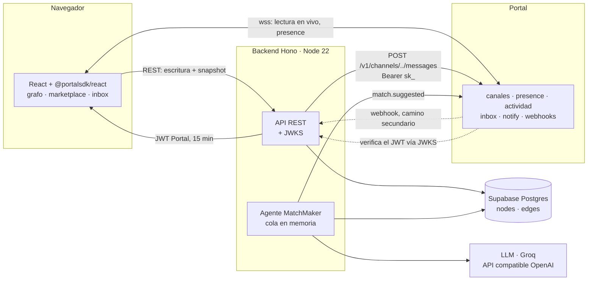
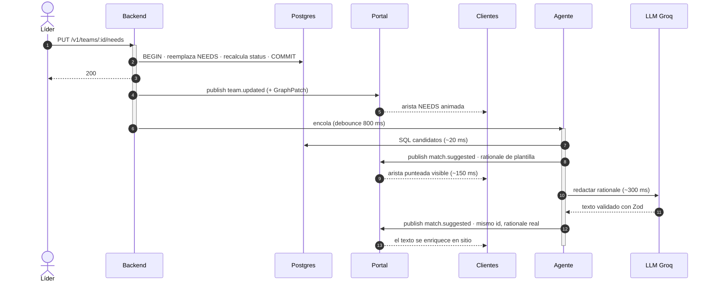
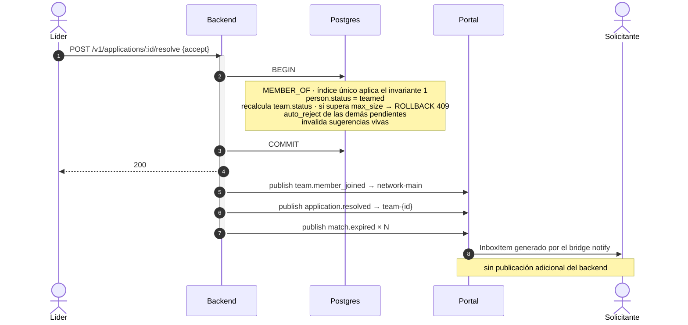

# 07 — Arquitectura

## Vista general



**El backend no tiene ni un solo websocket.** Toda conexión persistente la sostiene Portal. El backend es un servicio HTTP sin estado que puede reiniciarse en cualquier momento sin desconectar a nadie: solo se pierden las publicaciones en vuelo, que quedan registradas en `outbox`.

Consecuencia práctica: escala vertical/horizontalmente sin sesiones pegajosas, y un `deploy` no tira a los usuarios.

## Módulos

```
src/
  contracts/        ← @nodo/contracts: sobres, DTOs, tipos de grafo. Compartido con el frontend.
  db/               ← esquema, migraciones, queries tipadas
  domain/           ← invariantes y máquinas de estado. Sin HTTP, sin Portal.
  portal/           ← cliente de publicación, emisión de JWT, verificación de webhook
  agent/            ← scoring, prompts, cola, guardarraíles
  http/             ← rutas Hono, validación Zod, mapeo de errores
  jobs/             ← caducidad de sugerencias, drenaje de outbox
```

Regla de dependencias: `domain` no importa `portal` ni `http`. Los invariantes se prueban sin levantar nada.

Dos módulos exponen su dependencia externa detrás de una interfaz, no de una implementación concreta: `portal/` publica a través de `PortalPublisher` y `agent/` llama al modelo a través de `LlmProvider`. Son las dos costuras que hacen sustituibles a Portal y al proveedor de LLM — en pruebas ([10](10-testing.md)) y en producción ([ADR-007](01-decisions.md#adr-007--capa-de-llm-intercambiable)).

## Secuencia — caso de uso principal

El del criterio AC-02: un equipo publica una necesidad y el grafo revela quién la cubre.



**Tiempo hasta que se mueve el grafo: ~150 ms.** El texto del agente llega a ~1 s. Nadie percibe latencia.

## Secuencia — aceptar una solicitud



Las tres publicaciones van después del commit. Si una falla, cae a `outbox`; el estado en Postgres ya es correcto.

## Consistencia y reconexión

| Situación | Qué pasa |
|---|---|
| Cliente conecta por primera vez | `GET /v1/graph` → `seq` → suscribe → aplica sobres con `seq` mayor |
| Cliente pierde red 30 s | Portal reconecta y hace backfill (50 mensajes) → suficiente |
| Cliente pierde red 10 min | hueco de `seq` detectado → re-pide snapshot |
| Backend se reinicia | clientes intactos (Portal sostiene los sockets); se pierde la cola en memoria del agente |
| Portal falla al publicar | fila en `outbox`; job reintenta cada 10 s; el estado nunca se corrompe |
| Postgres falla | la escritura falla con 5xx; **no se publica nada**. Sin estados fantasma. |

El orden `commit → publish` garantiza que Portal nunca anuncia algo que Postgres no tiene. La inversa —publicar y que después falle el commit— deja a los clientes con un estado que no existe y no es recuperable automáticamente.

## Riesgos y mitigaciones

| Riesgo | Prob. | Impacto | Mitigación |
|---|---|---|---|
| Bucle del agente vía webhook | media | **fatal** | filtro `senderId` como primera línea del handler + `processed_events` |
| Umbral mal calibrado (sin sugerencias, o exceso de ellas) | **alta** | alto | calibrar contra los datos de semilla; el umbral es una variable de entorno, ajustable sin desplegar |
| Proveedor de LLM lento o caído | media | **bajo** | fallback de plantilla + timeout 4 s; el matching nunca depende del LLM, y cambiar de proveedor son 3 env vars ([ADR-007](01-decisions.md#adr-007--capa-de-llm-intercambiable)) |
| Publicar antes del commit | media | alto | regla única en [05](05-rest-api.md); code review de cada handler |
| `authz` mal configurado: ningún cliente conecta | baja | **fatal** | validar `portal deploy` contra un cliente real antes de construir sobre él |
| Origen no registrado en producción | media | alto | `portal origins add` como paso del despliegue, no manual |
| Grafo ilegible al crecer el número de nodos | media | medio | caducidad de sugerencias y filtrado por categoría |

Los dos riesgos marcados **fatal** se verifican antes de construir lógica de producto encima: ambos invalidan el sistema entero, no una funcionalidad.

## Deuda conocida

Asumida de forma deliberada y documentada:

- **Identidad suplantable** — sin contraseña, `sessionToken` en `localStorage` ([ADR-006](01-decisions.md)).
- **Cola en memoria** — un reinicio pierde una tanda de sugerencias.
- **Sin paginación en `/v1/graph`** — correcto hasta ~2.000 nodos.
- **Vocabulario de skills fijo** — no se aprenden tags nuevos en runtime.
- **Sin tests de integración contra Portal** — solo contra la capa de dominio.
